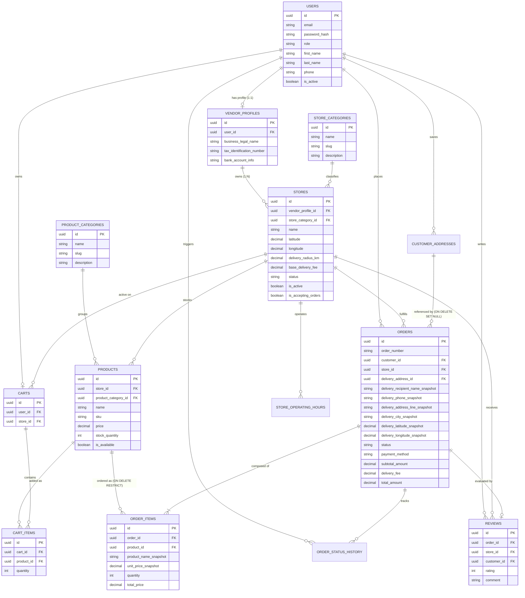

# PROJECT PLAN & ARCHITECTURAL REVIEW DOCUMENT
## GeoMarket: Location-Aware Dynamic Multi-Vendor Marketplace
**Document Type:** Pre-Development Executive & Technical Review Blueprint  
**Document Version:** 2.1.0 (Final Audited Baseline)  
**Target Audience:** Project Advisors, Academic Evaluators, Software Engineering Team  
**Status:** Architecture Audited & Approved — Ready for Phase 1 Implementation  

---

## 1. EXECUTIVE SUMMARY & PROJECT IDENTITY

### 1.1 Project Title & Core Identity
* **Project Name:** **GeoMarket**
* **Project Type:** Location-Aware Multi-Vendor E-Commerce Web Platform
* **Academic Context:** University Capstone / Enterprise Software Engineering Project
* **Architecture Style:** Clean Modular Monolith (Single deployable unit, decoupled domain modules, shared database)

### 1.2 The Elevator Pitch
**GeoMarket** is an e-commerce platform designed to bridge digital commerce with local physical retail. Unlike traditional marketplaces (e.g., Daraz, Amazon) where customers browse items shipped nationally with multi-day transit times, GeoMarket introduces a **hyperlocal spatial paradigm**: customers discover only stores that are physically proximate and capable of delivering to their current physical location.

### 1.3 The Core Differentiator: Dynamic Spatial Discovery
* **No Hardcoded Areas:** The system is **not** built on static strings like `if area == "D Ground" then show Store A`.
* **Mathematical Coordinates:** Every store defines a precise geographic coordinate centroid $(Lat_S, Lon_S)$ and a delivery radius $R_{delivery}$ (in kilometers).
* **4-Tier Store Discovery Eligibility:** A store is discoverable to a customer if and only if:
  1. Store status is `APPROVED` by an administrator.
  2. Store administrative flag `is_active` is `TRUE`.
  3. Store operational flag `is_accepting_orders` is `TRUE` and the current timestamp falls within the store's configured weekly operating hours.
  4. The geodesic distance $d$ between the customer's coordinates and the store's coordinates satisfies:
     $$d(Customer, Store) \le R_{\text{delivery}}$$

---

## 2. FINAL PRE-IMPLEMENTATION CORRECTIONS (V2.1 AUDIT SUMMARY)

| Audit Item | Previous Assumption | Final Corrected Architecture Baseline |
| :--- | :--- | :--- |
| **1. Vendor Ownership Hierarchy** | Direct `Users` $\rightarrow$ `Stores` ownership | **`Users` $\rightarrow$ `VendorProfiles` $\rightarrow$ `Stores`** ($1:1 \rightarrow 1:N$). Vendors are authorized strictly through `vendor_profile_id`. |
| **2. Auth Storage Strategy** | Unspecified or client-side storage | **Strictly Secure, HttpOnly, SameSite Cookies**. Storing JWTs in `localStorage` is explicitly prohibited to prevent XSS exfiltration. |
| **3. Password Hashing** | Mixed references ("Argon2/Bcrypt") | **Exclusively BCrypt** with cost factor 12. Standardized across all documentation. |
| **4. Prisma + PostGIS Access** | Ambiguous GIS abstraction | **Prisma for typed relational CRUD**; **Isolated Parameterized Raw SQL (`$queryRaw`)** for PostGIS spatial operators (`ST_DWithin`). |
| **5. Order Transition Auth** | Generic status change endpoints | **Explicit State Transition Authorization Matrix** validating both transition validity and requesting actor permissions. |
| **6. Core Architectural Pillars** | Preservation check | Location-first discovery, 4-tier check, modular monolith, single-store cart, COD payment, and immutable snapshots remain strictly preserved. |
| **7. Final Phase 1 Boundary** | Undefined initial boundary | **Strictly bounded** to scaffolding, Docker Compose, PostGIS, base auth (`users`, `vendor_profiles`, categories), BCrypt, and RBAC. |

---

## 3. FINAL ENTITY-RELATIONSHIP MODEL (ERD)

---

## 4. FINAL ORDER TRANSITION AUTHORIZATION MATRIX

Every state transition requires two validations:
1. **Transition Validity:** Must be a valid forward path in the FSM.
2. **Actor Authorization:** Requesting actor must have explicit ownership or role permission.

| From State | To State | Permitted Actor | Authorization Rule & Business Guard | Side Effects |
| :--- | :--- | :--- | :--- | :--- |
| `[NULL]` | `PLACED` | **Customer** | Authenticated Customer; cart belongs to one store; address within radius; store open & active. | Atomically deduct stock; snapshot address & prices; clear cart. |
| `PLACED` | `CANCELLED` | **Customer** | `order.customer_id == authenticated_user.id`. Can only cancel while status is `PLACED`. | Atomically restore stock; write cancellation audit log. |
| `PLACED` | `CONFIRMED` | **Vendor** | `order.store.vendor_profile.user_id == authenticated_user.id`. | Progress state; alert customer; write audit log. |
| `PLACED` | `CANCELLED` | **Vendor** | `order.store.vendor_profile.user_id == authenticated_user.id`. Mandatory cancellation reason string required. | Atomically restore stock; write cancellation reason & audit log. |
| `CONFIRMED` | `PREPARING` | **Vendor** | `order.store.vendor_profile.user_id == authenticated_user.id`. | Progress state; write audit log. |
| `CONFIRMED` | `CANCELLED` | **Vendor** | `order.store.vendor_profile.user_id == authenticated_user.id`. Emergency cancellation with mandatory reason. | Atomically restore stock; write cancellation reason & audit log. |
| `PREPARING` | `READY` | **Vendor** | `order.store.vendor_profile.user_id == authenticated_user.id`. Packaging complete; ready for delivery. | Progress state; write audit log. |
| `READY` | `OUT_FOR_DELIVERY` | **Vendor** | `order.store.vendor_profile.user_id == authenticated_user.id`. Store courier departs with order. | Record dispatch timestamp; write audit log. |
| `OUT_FOR_DELIVERY` | `DELIVERED` | **Vendor** | `order.store.vendor_profile.user_id == authenticated_user.id`. Courier delivers goods and collects COD payment. | Terminal state; unlock verified review creation. |
| *Any Active State* | `CANCELLED` | **Admin** | `authenticated_user.role == 'ADMIN'`. Administrative intervention (dispute resolution / fraud). | Restore stock; record administrative note. |

---

## 5. FINAL AUTHENTICATION ARCHITECTURE

* **Password Hashing:** **BCrypt** with cost factor 12.
* **Credential Storage:** Signed JWT issued inside an **`HttpOnly`, `Secure`, `SameSite=Lax` cookie**.
* **XSS Mitigation:** Complete prohibition of `localStorage` for authentication tokens. JavaScript cannot read `HttpOnly` cookies.
* **CSRF Mitigation:** `SameSite: 'Lax'` cookie attribute protects against cross-origin post requests.
* **Client Protocol:** Client (React / Axios / Fetch) issues requests with `credentials: 'include'`.

---

## 6. FINAL PHASE 1 IMPLEMENTATION BOUNDARY

### In Boundary for Phase 1
1. **Monorepo Layout:** Initialize `client/`, `server/`, and `shared/` workspace directories.
2. **Infrastructure Provisioning:** `docker-compose.yml` for PostgreSQL 16 with PostGIS 3.4.
3. **Baseline Database Migrations:** Prisma schema defining:
   * `users`
   * `vendor_profiles`
   * `store_categories`
   * `product_categories`
4. **Authentication & Identity Service:**
   * Customer and Vendor registration endpoints.
   * BCrypt password hashing.
   * JWT generation and validation via `HttpOnly` cookies.
   * RBAC authorization middleware (`requireRole`).

### Out of Boundary for Phase 1 (Strictly Blocked)
* No `stores` entity or store onboarding routes.
* No `products` entity or catalog management.
* No map rendering or Leaflet/OSM integration.
* No geospatial discovery queries or PostGIS functions.
* No `carts` or cart item logic.
* No `orders`, checkout, or FSM transition logic.
* No `reviews` or rating calculations.
