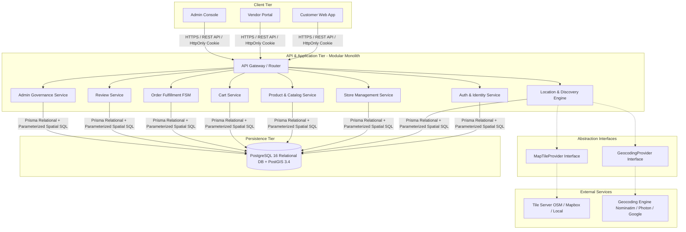
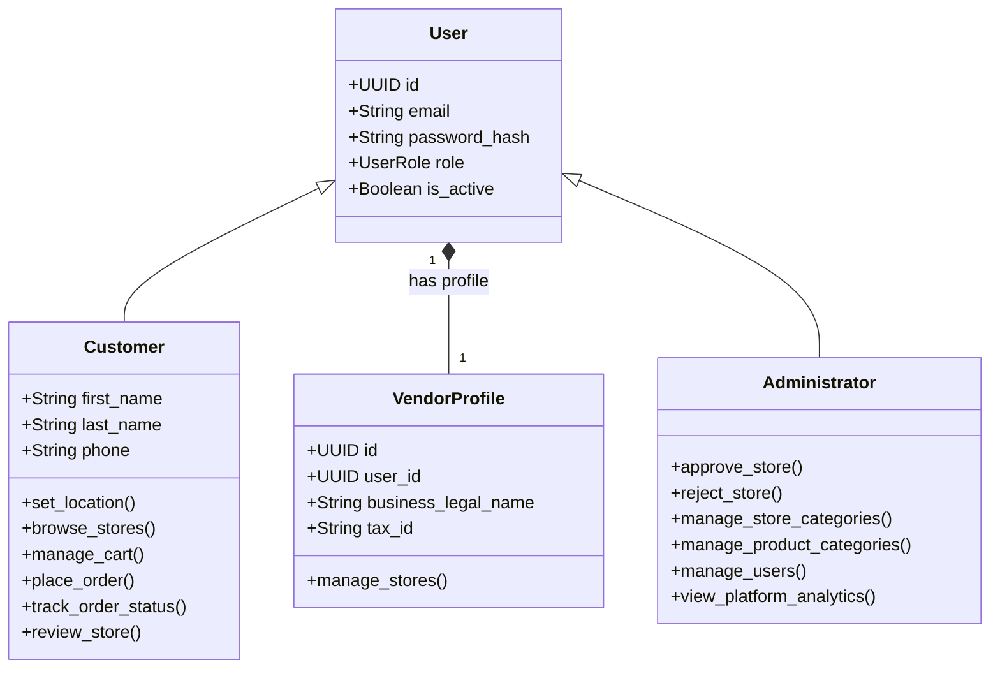
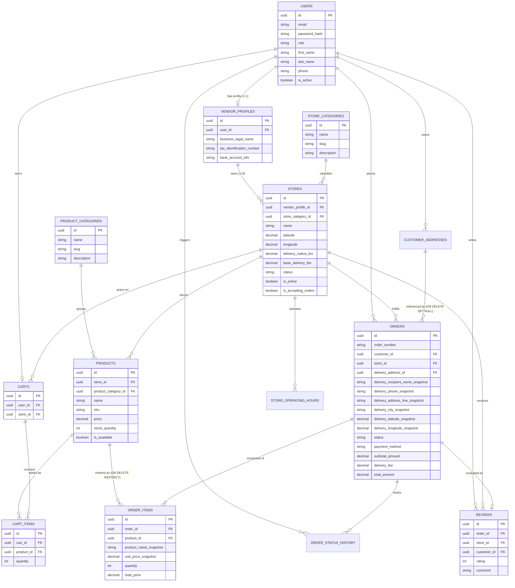

# SYSTEM REQUIREMENTS AND ARCHITECTURE SPECIFICATION (SRAS)
## GeoMarket: Location-Aware Dynamic Multi-Vendor E-Commerce Platform
**Document Version:** 2.1.0 (Final Pre-Implementation Baseline)  
**Target Platform:** Web Application (Academic Capstone / Enterprise Modular Monolith)  
**Status:** Approved & Implementation-Ready  

---

## 01 — PROJECT OVERVIEW

### 1.1 Project Title
**GeoMarket: A Location-Aware Dynamic Multi-Vendor E-Commerce Platform**

### 1.2 Project Purpose
GeoMarket is an advanced web-based multi-vendor marketplace engineered to bridge the divide between digital e-commerce and local physical retail commerce. Traditional e-commerce platforms operate on a location-agnostic fulfillment model where goods are cataloged nationally and dispatched through multi-day courier networks. GeoMarket establishes a **hyperlocal spatial commerce model**: the system dynamically detects and validates a customer's active location and restricts store discovery to merchants who are physically within reach and capable of fulfilling delivery to that customer's exact coordinates.

### 1.3 Product Concept
The platform operates as a decentralized multi-tenant marketplace where independent physical merchants (groceries, bakeries, pharmacies, electronics, apparel) dynamically register their storefronts, define their exact geographic centroid (latitude and longitude), configure their delivery radius, and manage their product catalogs and inventory. Customers access the marketplace, specify their physical location (via browser geolocation or manual address geocoding), and immediately discover active, approved local stores capable of serving their specific vicinity.

### 1.4 Target Users
1. **Local Consumers (Customers):** Urban and suburban shoppers seeking immediate, local access to retail goods, groceries, and specialty items with transparent local delivery timelines.
2. **Independent Merchants (Vendors / Store Owners):** Local merchants who lack proprietary digital e-commerce infrastructure but possess local logistics/delivery capability. A registered merchant user owns a `VendorProfile`, which in turn can own and operate multiple distinct `Store` entities.
3. **Platform Administrators:** Institutional or commercial marketplace operators responsible for compliance, vendor verification, store approval, category taxonomy governance, dispute arbitration, and platform oversight.

### 1.5 Main Differentiator: Spatial Pre-Filtering vs. Traditional Marketplaces
Unlike conventional multi-vendor platforms (e.g., Daraz, Amazon, AliExpress) where search queries return nationwide product listings, GeoMarket enforces **Spatial Pre-Filtering**:
* Stores are not hardcoded to arbitrary neighborhood names (e.g., "D Ground, Faisalabad").
* Every store defines an exact coordinate centroid and radial coverage boundary ($R_{delivery}$).
* Discovery is governed by geodesic distance calculations ($d \le R_{delivery}$), guaranteeing that any store displayed to a customer is physically capable of fulfilling delivery to that customer's coordinates.
* Cart and fulfillment logic are strictly scoped per store for the Minimum Viable Product (MVP), avoiding multi-vendor logistical fragmentation.

### 1.6 High-Level System Architecture Overview

---

## 02 — PROBLEM STATEMENT

### 2.1 The Traditional Marketplace Disconnect
Traditional multi-vendor e-commerce architectures assume centralized warehousing or national courier fulfillment. When a customer in an urban center (such as D Ground, Faisalabad) accesses a standard e-commerce platform, they are presented with listings from vendors located hundreds of kilometers away. This architecture fails local commerce in three critical ways:
1. **Logistical Latency:** Deliveries take 2 to 5 days, making daily essentials (groceries, dairy, fresh baked goods, urgent supplies) unviable.
2. **High Shipping Overheads:** National courier rates are disproportionate for low-cost everyday commodities.
3. **Lack of Hyperlocal Trust:** Consumers have existing relationships and familiarity with local physical neighborhood retailers, yet these retailers remain digitally invisible.

### 2.2 The Local Commerce Fragmentation Problem
Local physical merchants face significant barriers in adopting digital commerce:
* Building, hosting, and marketing independent e-commerce applications is cost-prohibitive and technically complex for small-to-medium businesses.
* Existing food-delivery platforms impose high commission structures (25–35%) and are fundamentally optimized for prepared meals rather than diverse retail inventories (hardware, electronics, apparel, stationery).
* Neighborhood businesses lack dynamic tools to define their delivery boundaries, leading to manual order cancellations when customers order from outside their delivery territory.

### 2.3 The Customer Discovery Problem
Customers who wish to support local businesses or receive rapid same-day neighborhood deliveries lack a single discovery engine. They have no centralized platform to query: *"Which bakeries, pharmacies, or electronics shops within 4 kilometers of my current location are open right now and can deliver to my doorstep?"*

### 2.4 Academic Justification
From a software engineering and computer science perspective, solving this requires addressing algorithmic challenges in spatial query optimization, dynamic multi-tenant role-based data isolation, distributed cart consistency, and deterministic state-machine transaction workflows within a relational framework.

---

## 03 — PROPOSED SOLUTION

GeoMarket resolves this market failure through a coordinate-driven, location-aware e-commerce architecture.

```mermaid
flowchart LR
    L[Customer Location Lat/Lon] --> D[Spatial Discovery Engine]
    D -->|PostGIS GiST / Parameterized Raw SQL| E[Filter Eligible Stores - 4-Tier Check]
    E --> C[Store Category Filter]
    C --> S[Store Front & Product Catalog]
    S --> P[Add to Store-Specific Cart]
    P --> CO[Checkout with Address Snapshot]
    CO --> O[Order Status Tracking FSM]
```

### 3.1 Solution Workflow
1. **Dynamic Spatial Onboarding:** Any merchant can register an account, obtain a `VendorProfile`, create a store profile, pin their storefront on an interactive map (capturing latitude and longitude), select a primary store category, and configure a delivery radius ($R$ in kilometers).
2. **Administrative Quality Gate:** The store remains in a `PENDING_APPROVAL` state. Platform administrators inspect merchant credentials and business information before granting `APPROVED` status.
3. **Location Capture & Spatial Filtering:** Upon accessing the customer client, the user's coordinates $(Lat_C, Lon_C)$ are captured via the browser Geolocation API or manual address geocoding. The backend evaluates spatial distances against all approved, active, and order-accepting stores:
   $$\text{Distance}(Store, Customer) \le R_{\text{delivery}}$$
4. **Contextual Shopping Experience:** The customer browses stores categorized by trade (Groceries, Electronics, Apparel, etc.), visits a selected store's digital storefront, and selects items.
5. **Enforced Single-Store Cart Architecture:** To avoid logistics conflicts, the cart enforces single-store integrity. Attempting to add an item from a different store triggers an explicit confirmation modal preventing accidental vendor interleaving.
6. **Controlled Order Lifecycle:** Placed orders follow an explicit, state-transition-enforced lifecycle (`PLACED` to `DELIVERED`) monitored via stepped order status tracking.

---

## 04 — PROJECT OBJECTIVES

* **OBJ-01 (Dynamic Multi-Tenancy):** Implement an onboarding mechanism where a registered Vendor user possesses a `VendorProfile` capable of creating and managing multiple independent storefronts without developer intervention.
* **OBJ-02 (Coordinate-Driven Discovery):** Formulate and implement an efficient geospatial search algorithm (PostGIS spatial indexing with parameterized raw SQL) to dynamically calculate customer-to-store proximity and filter stores against merchant delivery boundaries.
* **OBJ-03 (Provider Abstraction):** Architect pluggable abstractions for map tiles (`MapTileProvider`) and geocoding (`GeocodingProvider`) to eliminate hard coupling to public, rate-limited third-party infrastructure.
* **OBJ-04 (Single-Vendor Cart Isolation):** Architect a deterministic cart and checkout engine that guarantees transaction atomicity and prevents multi-vendor order collisions during the MVP phase.
* **OBJ-05 (Immutable Order Snapshotting):** Preserve complete audit integrity by snapshotting delivery addresses, geographic coordinates, and product prices at the moment of order placement.
* **OBJ-06 (Finite State Machine Fulfillment):** Design a strictly enforced order state machine validating both transition legitimacy and actor authorization.
* **OBJ-07 (Secure Authentication):** Implement session management exclusively using secure, `HttpOnly`, `SameSite` cookies with BCrypt password hashing.

---

## 05 — PROJECT SCOPE

```mermaid
graph LR
    subgraph IN SCOPE MVP
        A1[VendorProfile Multi-Store Model 1:N]
        A2[Admin Approval & Suspension Workflow]
        A3[4-Tier Coordinate-Based Store Discovery]
        A4[Separate Store & Product Category Taxonomies]
        A5[Product & Inventory Catalog Mgmt]
        A6[Single-Store Cart with Conflict Interception]
        A7[Address Geocoding & Order Location Snapshotting]
        A8[Cash on Delivery COD Payment Model]
        A9[Order Status Tracking PLACED to DELIVERED]
        A10[Verified Customer Store Reviews]
        A11[Pluggable Map & Geocoding Abstractions]
        A12[HttpOnly Cookie JWT Authentication]
        A13[BCrypt Password Hashing]
    end

    subgraph OUT OF SCOPE Post-MVP / Future Work
        B1[Third-Party Automated Rider Fleet Dispatch]
        B2[Real-Time Continuous Rider GPS Telemetry]
        B3[Multi-Vendor Split-Cart Unified Checkout]
        B4[Online Payment Gateway Integration Stripe / JazzCash]
        B5[AI/ML Personalized Recommendation Engines]
        B6[Dynamic Surge Pricing Algorithms]
        B7[Customer-to-Merchant In-App Voice/Chat]
    end
```

---

## 06 — ACTORS AND ROLES

### 6.1 Customer
* **Description:** An authenticated end-user who accesses the application to discover local stores, browse product offerings, place orders, and track fulfillment status.
* **Responsibilities:** Maintain accurate profile information, provide precise delivery coordinates, review order contents prior to submission, and accept delivery via Cash on Delivery.
* **Permissions:** Read approved stores and active products; manage own cart; create and read own orders; track order status; create reviews for fulfilled orders; manage personal delivery addresses.

### 6.2 Vendor / Store Owner
* **Description:** A registered merchant entity represented by a `VendorProfile` that owns and operates one or more physical retail outlets (`Stores`).
* **Responsibilities:** Maintain accurate store operational data (coordinates, operating hours, delivery radius, order acceptance toggle), maintain real-time inventory counts, update order statuses truthfully, and execute fulfillment.
* **Permissions:** Create store entities under owned `VendorProfile` (initially pending approval); manage owned store profiles and delivery settings; CRUD operations on products and inventory within owned stores; view and update statuses of orders placed with owned stores.
* **Authorization Rule:** A vendor is authorized to manage a store if and only if:
  $$\text{store}.\text{vendor\_profile\_id} == \text{authenticated\_user}.\text{vendor\_profile}.\text{id}$$

### 6.3 Platform Administrator
* **Description:** A privileged user responsible for platform integrity, security, category taxonomies, merchant onboarding compliance, and operational dispute management.
* **Responsibilities:** Verify legitimacy of registered vendor stores, enforce platform standards, resolve stuck orders, and manage platform-wide classification categories.
* **Permissions:** Read all platform entities; approve/reject/suspend stores; activate/deactivate users; create/edit/delete store categories and product categories; override order statuses in dispute; view aggregate business intelligence analytics.

---

## 07 — FUNCTIONAL REQUIREMENTS

### 7.1 Authentication & Authorization (AUTH)
* **FR-AUTH-001:** The system shall allow users to register by providing an email, password, full name, phone number, and account type (`CUSTOMER` or `VENDOR`).
* **FR-AUTH-002:** The system shall hash user passwords exclusively using the **BCrypt** cryptographic hashing algorithm with a minimum cost factor of 12 prior to persistence.
* **FR-AUTH-003:** Upon successful authentication, the system shall issue a digitally signed JSON Web Token (JWT) transmitted to the client exclusively within a **Secure, HttpOnly, SameSite cookie**.
* **FR-AUTH-004:** The system shall prohibit the storage of authentication credentials in client-side `localStorage` or `sessionStorage` to eliminate token exfiltration via Cross-Site Scripting (XSS).
* **FR-AUTH-005:** The system shall automatically create a `vendor_profiles` record for any user registered with the `VENDOR` role.
* **FR-AUTH-006:** The system shall enforce Role-Based Access Control (RBAC) on all protected API endpoints and screen routes.
* **FR-AUTH-007:** The system shall restrict vendors to accessing and mutating only the stores, products, inventory records, and orders that belong to their owned `VendorProfile`.

### 7.2 Customer & Profile Management (CUST)
* **FR-CUST-001:** The system shall allow customers to manage personal profile attributes including phone number and contact details.
* **FR-CUST-002:** The system shall allow customers to save multiple labeled delivery addresses (e.g., "Home", "Work") containing human-readable address lines, city, and explicit geographic coordinates.
* **FR-CUST-003:** The system shall allow customers to set one saved address as their primary/default location.

### 7.3 Location Services & Provider Abstraction (LOC)
* **FR-LOC-001:** The system shall define a `GeocodingProvider` interface to resolve text addresses to coordinates (forward geocoding) and coordinates to text addresses (reverse geocoding).
* **FR-LOC-002:** The system shall provide a default implementation of `GeocodingProvider` adhering to third-party usage limits and supporting configuration-driven swapping.
* **FR-LOC-003:** The system shall capture the customer's current geographic coordinates (latitude, longitude) using the browser Geolocation API upon receiving explicit user consent.
* **FR-LOC-004:** The system shall allow customers to manually enter an address or move a map pin to establish reference coordinates if geolocation permissions are denied or unavailable.
* **FR-LOC-005:** The system shall validate that provided coordinates conform to valid geographic boundaries (latitude between $-90.0$ and $+90.0$, longitude between $-180.0$ and $+180.0$).

### 7.4 Store Discovery & Spatial Filtering (DISC)
* **FR-DISC-001:** The system shall evaluate store eligibility using a **4-tier criteria check**:
  1. Store approval status is `APPROVED`.
  2. Store administrative status is `is_active = TRUE`.
  3. Store operational status is `is_accepting_orders = TRUE` and current local time falls within configured `store_operating_hours`.
  4. Geodesic distance $d$ between customer coordinates and store coordinates satisfies $d \le R_{delivery}$.
* **FR-DISC-002:** Proximity filtering shall execute via isolated database repository methods executing parameterized raw SQL utilizing PostGIS functions (`ST_DWithin`, `ST_Distance`, `ST_SetSRID`, `ST_MakePoint`) over spatial GiST indexes.
* **FR-DISC-003:** The system shall allow customers to filter discoverable nearby stores by one or more `StoreCategory` entities.
* **FR-DISC-004:** The system shall allow customers to sort discoverable stores by proximity (nearest first), average rating (highest first), or minimum order amount.

### 7.5 Categories & Taxonomy (CAT)
* **FR-CAT-001:** The system shall maintain independent database entities for **Store Categories** (classifying retail store types) and **Product Categories** (classifying items within stores).
* **FR-CAT-002:** The system shall allow platform administrators to perform CRUD operations on global Store Categories (e.g., Groceries, Bakeries, Electronics, Pharmacy).
* **FR-CAT-003:** The system shall allow platform administrators to perform CRUD operations on global Product Categories, and allow vendors to associate products with relevant product categories.
* **FR-CAT-004:** The system shall require every store to be associated with at least one primary Store Category upon registration.

### 7.6 Vendor & Multi-Store Management (VEND)
* **FR-VEND-001:** The system shall permit a single `VendorProfile` to create and manage multiple independent stores ($1:N$).
* **FR-VEND-002:** The system shall require each store to be registered with: Store Name, Legal/Business Registration Number, Contact Phone, Physical Address, Coordinates (Lat/Lon), Primary Store Category, Delivery Radius (in km), and Base Delivery Fee.
* **FR-VEND-003:** The system shall automatically assign newly registered stores an initial status of `PENDING_APPROVAL`.
* **FR-VEND-004:** The system shall allow vendors to configure weekly operating schedules (opening time and closing time for each day of the week) for each owned store.
* **FR-VEND-005:** The system shall allow vendors to toggle an emergency `is_accepting_orders` switch for each owned store.

### 7.7 Product & Catalog Management (PROD)
* **FR-PROD-001:** The system shall allow vendors to create, edit, view, and delete products belonging exclusively to their owned stores.
* **FR-PROD-002:** The system shall require products to have a Name, Description, Product Category, Price (positive numeric), SKU (unique within the store), and at least one image URL.
* **FR-PROD-003:** The system shall allow vendors to toggle product visibility (`is_available = TRUE / FALSE`).
* **FR-PROD-004:** The system shall prevent vendors from viewing private catalog data or modifying products associated with other vendors' stores.

### 7.8 Inventory Control (INV)
* **FR-INV-001:** The system shall maintain an integer `stock_quantity` attribute for each product.
* **FR-INV-002:** The system shall prevent customers from adding a quantity of a product to their cart exceeding the available `stock_quantity`.
* **FR-INV-003:** The system shall atomically decrement the product's `stock_quantity` upon successful order placement within an ACID database transaction.
* **FR-INV-004:** The system shall restore the deducted `stock_quantity` if an order is cancelled or rejected prior to fulfillment.

### 7.9 Shopping Cart Architecture (CART)
* **FR-CART-001:** The system shall associate a customer's active cart with exactly one store at any given time.
* **FR-CART-002:** The system shall allow customers to add products, adjust quantities, or remove items from their active cart.
* **FR-CART-003:** When a customer attempts to add a product from Store B while the cart contains items from Store A, the system shall intercept the action and present an explicit confirmation prompt: *"Your cart contains items from Store A. Discard existing items and start a new cart with Store B?"*
* **FR-CART-004:** The system shall clear existing cart items only upon explicit customer confirmation of the multi-store replacement prompt.

### 7.10 Checkout & Immutable Snapshotting (CHK)
* **FR-CHK-001:** The system shall allow checkout only if the store satisfies all 4 discovery eligibility criteria and the selected delivery address falls within the store's delivery radius.
* **FR-CHK-002:** The system shall support Cash on Delivery (COD) as the primary payment method for the MVP.
* **FR-CHK-003:** The system shall snapshot the complete delivery address (recipient name, contact phone, address line, city, latitude, longitude) into the order record at the moment of checkout, ensuring historical orders are immune to subsequent address edits or deletions.
* **FR-CHK-004:** The system shall snapshot product unit prices and product names into `order_items` at the moment of checkout, ensuring historical orders are immune to subsequent product price updates.

### 7.11 Order Status Tracking & Fulfillment FSM (ORD)
* **FR-ORD-001:** The system shall initialize new orders in the `PLACED` state.
* **FR-ORD-002:** The system shall enforce deterministic state transitions validated against both transition legitimacy and actor permissions.
* **FR-ORD-003:** The system shall permit the customer to track the order status via a stepped progression interface. Real-time continuous courier GPS telemetry is excluded from MVP.
* **FR-ORD-004:** The system shall record a complete audit trail (timestamp, previous state, new state, user ID) for every status transition in `order_status_history`.

---

## 08 — DATABASE ARCHITECTURE

### 8.1 Data Access Strategy: Prisma + PostGIS Parameterized SQL
1. **Standard Relational Access:** Prisma ORM is utilized for standard relational CRUD operations, schema migrations, typed models, foreign key enforcement, and relational loading (`include`, `select`).
2. **PostGIS Geospatial Operations:** Because Prisma does not natively abstract spatial functions, PostGIS spatial queries are executed via **parameterized raw SQL** (`prisma.$queryRaw`) encapsulated strictly within the `StoreRepository` / `LocationService`.
3. **Security:** All spatial queries must remain strictly parameterized using template literals or parameter binding to prevent SQL injection vulnerabilities.

### 8.2 Entity Specifications

#### 1. `users`
* **Purpose:** Identity credentials for all actors.
* **Attributes:** `id` (UUID, PK), `email` (VARCHAR 255, Unique), `password_hash` (VARCHAR 255), `role` (ENUM: 'CUSTOMER', 'VENDOR', 'ADMIN'), `first_name` (VARCHAR 100), `last_name` (VARCHAR 100), `phone` (VARCHAR 20), `is_active` (BOOLEAN, Default: TRUE), `created_at`, `updated_at`.

#### 2. `vendor_profiles`
* **Purpose:** Merchant profile linking a Vendor User to multiple Stores.
* **Attributes:** `id` (UUID, PK), `user_id` (UUID, FK $\rightarrow$ `users.id`, Unique), `business_legal_name` (VARCHAR 255), `tax_identification_number` (VARCHAR 100, Nullable), `bank_account_info` (TEXT, Nullable), `created_at`.

#### 3. `store_categories`
* **Purpose:** Classifies physical store trades (Groceries, Bakeries, etc.).
* **Attributes:** `id` (UUID, PK), `name` (VARCHAR 100, Unique), `slug` (VARCHAR 100, Unique), `description` (TEXT), `icon_url` (VARCHAR 500), `is_active` (BOOLEAN, Default: TRUE), `created_at`.

#### 4. `stores`
* **Purpose:** Physical retail outlets owned by a VendorProfile.
* **Attributes:** `id` (UUID, PK), `vendor_profile_id` (UUID, FK $\rightarrow$ `vendor_profiles.id`), `store_category_id` (UUID, FK $\rightarrow$ `store_categories.id`), `name` (VARCHAR 255), `slug` (VARCHAR 255, Unique), `description` (TEXT), `address_line` (VARCHAR 500), `city` (VARCHAR 100), `latitude` (DECIMAL 10,8), `longitude` (DECIMAL 11,8), `delivery_radius_km` (DECIMAL 5,2, Check $> 0$), `base_delivery_fee` (DECIMAL 10,2), `min_order_amount` (DECIMAL 10,2), `status` (ENUM: 'PENDING_APPROVAL', 'APPROVED', 'REJECTED', 'SUSPENDED'), `is_active` (BOOLEAN, Default: FALSE), `is_accepting_orders` (BOOLEAN, Default: TRUE), `average_rating` (DECIMAL 3,2, Default: 0.00), `total_reviews` (INTEGER, Default: 0), `created_at`, `updated_at`.

#### 5. `store_operating_hours`
* **Purpose:** Weekly schedules per store.
* **Attributes:** `id` (UUID, PK), `store_id` (UUID, FK $\rightarrow$ `stores.id`), `day_of_week` (SMALLINT, 0 = Sunday, 6 = Saturday), `opening_time` (TIME), `closing_time` (TIME), `is_closed` (BOOLEAN, Default: FALSE).

#### 6. `product_categories`
* **Purpose:** Classifies merchandise items (Dairy, Cables, etc.).
* **Attributes:** `id` (UUID, PK), `name` (VARCHAR 100, NOT NULL), `slug` (VARCHAR 100, NOT NULL), `description` (TEXT), `created_at`.

#### 7. `products`
* **Purpose:** Merchandise cataloged under a specific store.
* **Attributes:** `id` (UUID, PK), `store_id` (UUID, FK $\rightarrow$ `stores.id`), `product_category_id` (UUID, FK $\rightarrow$ `product_categories.id`), `name` (VARCHAR 255), `description` (TEXT), `sku` (VARCHAR 100), `price` (DECIMAL 10,2, Check $> 0$), `stock_quantity` (INTEGER, Check $\ge 0$), `is_available` (BOOLEAN, Default: TRUE), `image_url` (VARCHAR 500), `created_at`, `updated_at`. *Constraint:* UNIQUE(`store_id`, `sku`).

#### 8. `customer_addresses`
* **Purpose:** Saved delivery endpoints for customers.
* **Attributes:** `id` (UUID, PK), `user_id` (UUID, FK $\rightarrow$ `users.id`), `address_label` (VARCHAR 50), `address_line` (VARCHAR 500), `city` (VARCHAR 100), `latitude` (DECIMAL 10,8), `longitude` (DECIMAL 11,8), `is_default` (BOOLEAN, Default: FALSE).

#### 9. `carts`
* **Purpose:** Active shopping basket header for a customer.
* **Attributes:** `id` (UUID, PK), `user_id` (UUID, FK $\rightarrow$ `users.id`, Unique), `store_id` (UUID, FK $\rightarrow$ `stores.id`, Nullable), `created_at`, `updated_at`.

#### 10. `cart_items`
* **Purpose:** Line items within a customer's active cart.
* **Attributes:** `id` (UUID, PK), `cart_id` (UUID, FK $\rightarrow$ `carts.id` ON DELETE CASCADE), `product_id` (UUID, FK $\rightarrow$ `products.id`), `quantity` (INTEGER, Check $> 0$). *Constraint:* UNIQUE(`cart_id`, `product_id`).

#### 11. `orders`
* **Purpose:** Fulfilled purchase transactions bound to a single store with snapshot integrity.
* **Attributes:** `id` (UUID, PK), `order_number` (VARCHAR 50, Unique), `customer_id` (UUID, FK $\rightarrow$ `users.id`), `store_id` (UUID, FK $\rightarrow$ `stores.id`), `delivery_address_id` (UUID, FK $\rightarrow$ `customer_addresses.id`, ON DELETE SET NULL, Nullable), `delivery_recipient_name_snapshot` (VARCHAR 200), `delivery_phone_snapshot` (VARCHAR 20), `delivery_address_line_snapshot` (VARCHAR 500), `delivery_city_snapshot` (VARCHAR 100), `delivery_latitude_snapshot` (DECIMAL 10,8), `delivery_longitude_snapshot` (DECIMAL 11,8), `status` (ENUM: 'PLACED', 'CONFIRMED', 'PREPARING', 'READY', 'OUT_FOR_DELIVERY', 'DELIVERED', 'CANCELLED'), `payment_method` (ENUM: 'CASH_ON_DELIVERY'), `subtotal_amount` (DECIMAL 10,2), `delivery_fee` (DECIMAL 10,2), `total_amount` (DECIMAL 10,2), `cancellation_reason` (TEXT, Nullable), `cancelled_by` (UUID, FK $\rightarrow$ `users.id`, Nullable), `created_at`, `updated_at`.

#### 12. `order_items`
* **Purpose:** Immutable line items for placed orders.
* **Attributes:** `id` (UUID, PK), `order_id` (UUID, FK $\rightarrow$ `orders.id` ON DELETE RESTRICT), `product_id` (UUID, FK $\rightarrow$ `products.id` ON DELETE RESTRICT), `product_name_snapshot` (VARCHAR 255), `unit_price_snapshot` (DECIMAL 10,2), `quantity` (INTEGER), `total_price` (DECIMAL 10,2).

#### 13. `order_status_history`
* **Purpose:** Audit trail of order lifecycle state changes.
* **Attributes:** `id` (UUID, PK), `order_id` (UUID, FK $\rightarrow$ `orders.id` ON DELETE CASCADE), `previous_status` (VARCHAR 50), `new_status` (VARCHAR 50), `changed_by_user_id` (UUID, FK $\rightarrow$ `users.id`), `notes` (TEXT), `created_at`.

#### 14. `reviews`
* **Purpose:** Verified customer ratings and commentary for fulfilled orders.
* **Attributes:** `id` (UUID, PK), `order_id` (UUID, FK $\rightarrow$ `orders.id`, Unique), `customer_id` (UUID, FK $\rightarrow$ `users.id`), `store_id` (UUID, FK $\rightarrow$ `stores.id`), `rating` (SMALLINT, Check 1–5), `comment` (TEXT), `created_at`.

---

## 09 — DATABASE RELATIONSHIPS / FINAL ERD

---

## 10 — ORDER TRANSITION AUTHORIZATION MATRIX

Every order transition must satisfy dual validation at the backend layer:
1. **Transition Validity:** The target state is an allowed forward path in the FSM.
2. **Actor Authorization:** The requesting actor has explicit permission to execute the transition.

| From State | To State | Permitted Actor | Authorization & Business Rule Validation | Side Effects |
| :--- | :--- | :--- | :--- | :--- |
| `[NULL]` | `PLACED` | **Customer** | Customer is authenticated; cart is non-empty; address within delivery radius; store open & active. | Deduct inventory stock atomically; record address & price snapshots; clear cart. |
| `PLACED` | `CANCELLED` | **Customer** | `order.customer_id == authenticated_user.id`. Customer can cancel only while status is `PLACED`. | Atomically restore inventory stock; write audit log. |
| `PLACED` | `CONFIRMED` | **Vendor** | `order.store.vendor_profile.user_id == authenticated_user.id`. Vendor accepts order. | Transition state; write audit log; alert customer. |
| `PLACED` | `CANCELLED` | **Vendor** | `order.store.vendor_profile.user_id == authenticated_user.id`. Mandatory cancellation reason string required. | Atomically restore inventory stock; write cancellation reason & audit log. |
| `CONFIRMED` | `PREPARING` | **Vendor** | `order.store.vendor_profile.user_id == authenticated_user.id`. Order enters kitchen/packaging preparation. | Transition state; write audit log. |
| `CONFIRMED` | `CANCELLED` | **Vendor** | `order.store.vendor_profile.user_id == authenticated_user.id`. Emergency rejection with mandatory reason. | Atomically restore inventory stock; write audit log. |
| `PREPARING` | `READY` | **Vendor** | `order.store.vendor_profile.user_id == authenticated_user.id`. Packaging complete; awaiting courier. | Transition state; write audit log. |
| `READY` | `OUT_FOR_DELIVERY` | **Vendor** | `order.store.vendor_profile.user_id == authenticated_user.id`. Store courier departs for customer destination. | Record dispatch timestamp; write audit log. |
| `OUT_FOR_DELIVERY` | `DELIVERED` | **Vendor** | `order.store.vendor_profile.user_id == authenticated_user.id`. Courier hands over goods and collects COD payment. | Unlock verified review creation for customer; mark terminal state. |
| *Any Active State* | `CANCELLED` | **Admin** | `authenticated_user.role == 'ADMIN'`. Administrative intervention (dispute resolution / fraud). | Restore stock; record administrative note. |

---

## 11 — AUTHENTICATION & SECURITY ARCHITECTURE

### 11.1 Password Hashing Specification
* **Algorithm:** **BCrypt**
* **Work Factor:** Cost factor 12 ($2^{12}$ iterations).
* **Policy:** Raw passwords are never persisted, cached, or logged. BCrypt salting is generated uniquely per password hash.

### 11.2 Session & Token Credential Storage
* **Mechanism:** Signed JSON Web Tokens (JWT) using HMAC-SHA256.
* **Storage Location:** Strictly transmitted via **Secure, HttpOnly, SameSite cookies**.
* **Prohibition:** Storage of JWTs in browser `localStorage` or `sessionStorage` is strictly forbidden.
* **Cookie Configuration Attributes:**
  * `HttpOnly: true` — Inaccessible to JavaScript `document.cookie`, providing complete immunity against token exfiltration via Cross-Site Scripting (XSS).
  * `Secure: true` — Transmitted only over encrypted TLS/HTTPS connections (set to `false` only in non-HTTPS local dev environments via environment variables).
  * `SameSite: 'Lax'` — Defends against Cross-Site Request Forgery (CSRF) while permitting top-level navigation.
  * `Path: '/'` — Scoped to the entire API origin.
  * `Max-Age / Expires:` Configured to 3600 seconds (1 hour) with refresh token rotation.
* **Client Integration:** The frontend (React / Axios / Fetch) configures `credentials: 'include'` on all API requests.

---

## 12 — FINAL PHASE 1 BOUNDARY

### In Boundary for Phase 1
1. **Repository Layout:** Monorepo directory structure (`client/`, `server/`, `shared/`).
2. **Infrastructure:** `docker-compose.yml` configuring PostgreSQL 16 with PostGIS 3.4.
3. **Database Migrations:** Baseline Prisma schema for:
   * `users`
   * `vendor_profiles`
   * `store_categories`
   * `product_categories`
4. **Authentication & Identity Service:**
   * Customer and Vendor registration endpoints.
   * BCrypt password hashing (cost factor 12).
   * JWT session token issuance and validation via `HttpOnly` cookies.
   * RBAC authorization middleware (`requireRole('CUSTOMER')`, `requireRole('VENDOR')`, `requireRole('ADMIN')`).

### Out of Boundary for Phase 1 (Strictly Blocked)
* No `stores` entity or store onboarding routes.
* No `products` entity or catalog management.
* No map rendering or Leaflet/OSM integration.
* No geospatial discovery queries or PostGIS functions.
* No `carts` or cart item logic.
* No `orders`, checkout, or FSM transition logic.
* No `reviews` or rating calculations.
