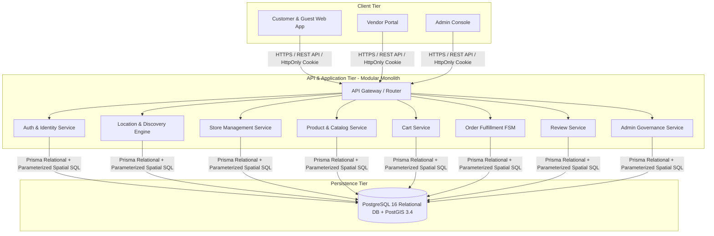

# SYSTEM REQUIREMENTS AND ARCHITECTURE SPECIFICATION (SRAS)
## GeoMarket: Location-Aware Dynamic Multi-Vendor E-Commerce Platform

> **Document Classification:** Master System Requirements Index & Specification Hub  
> **Document Version:** 2.1.0 (Production Verified Baseline)  
> **Target Platform:** Web Application (Academic Capstone / Enterprise Modular Monolith)  
> **Status:** Approved & Implemented  

---

## 🏛 Architecture Specification Index

To enable fast, targeted review without navigating monolithic 600+ line specifications, the system requirements are partitioned into modular, focused documents:

| Document | Code | Scope & Contents | Primary Focus |
|---|---|---|---|
| [**01 — System Overview & Scope**](file:///c:/Users/ahmad/AndroidStudioProjects/ecom/docs/requirements/01_system_overview_and_scope.md) | `REQ-01` | Executive Overview, Problem Statement, Hyperlocal Solution, Objectives, In/Out Scope Matrix, Actor Definitions | Project Identity & High-Level System Architecture |
| [**02 — Functional Requirements**](file:///c:/Users/ahmad/AndroidStudioProjects/ecom/docs/requirements/02_functional_requirements.md) | `REQ-02` | Detailed requirements across 13 domains: AUTH, CUST, LOC, DISC, CAT, VEND, PROD, INV, CART, CHK, ORD, GST, ADM | Core Business Rules & Feature Specifications |
| [**03 — Database Architecture & ERD**](file:///c:/Users/ahmad/AndroidStudioProjects/ecom/docs/requirements/03_database_and_erd.md) | `REQ-03` | Prisma ORM + PostGIS Raw SQL strategy, 14 Entity Specifications, Generated Columns, Complete Mermaid ERD | Data Modeling, Schema & Relational Integrity |
| [**04 — Order FSM & Security Architecture**](file:///c:/Users/ahmad/AndroidStudioProjects/ecom/docs/requirements/04_order_fsm_and_security.md) | `REQ-04` | Order Transition Authorization Matrix, BCrypt Password Security, Secure HttpOnly Cookie JWT Sessions, Tenant Isolation | Security, Finite State Machines & Access Control |

---

## 🚀 Quick Reference Summary

### Core Differentiator: Hyperlocal Spatial Discovery
GeoMarket dynamically detects a customer's coordinates $(Lat_C, Lon_C)$ and validates them against merchant delivery boundaries using native PostGIS geodesic calculations ($ST\_DWithin$). Stores appear in the marketplace if and only if they satisfy the **4-Tier Discovery Rule**:
1. **Governance Approval:** Status is `APPROVED`.
2. **Administrative State:** `isActive == true`.
3. **Operational State & Hours:** `isAcceptingOrders == true` and current local time falls within weekly `store_operating_hours`.
4. **Spatial Reachability:** Customer coordinates fall within merchant delivery radius ($R_{\text{delivery}}$).

### High-Level System Diagram

---

*For full deep-dive architectural flows and page-by-page technical specifications, see the [Master Architecture Document](file:///c:/Users/ahmad/AndroidStudioProjects/ecom/docs/master_document.md).*
