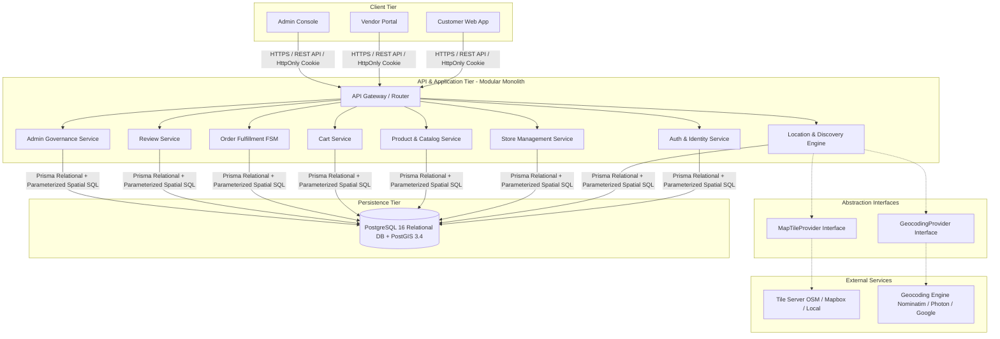
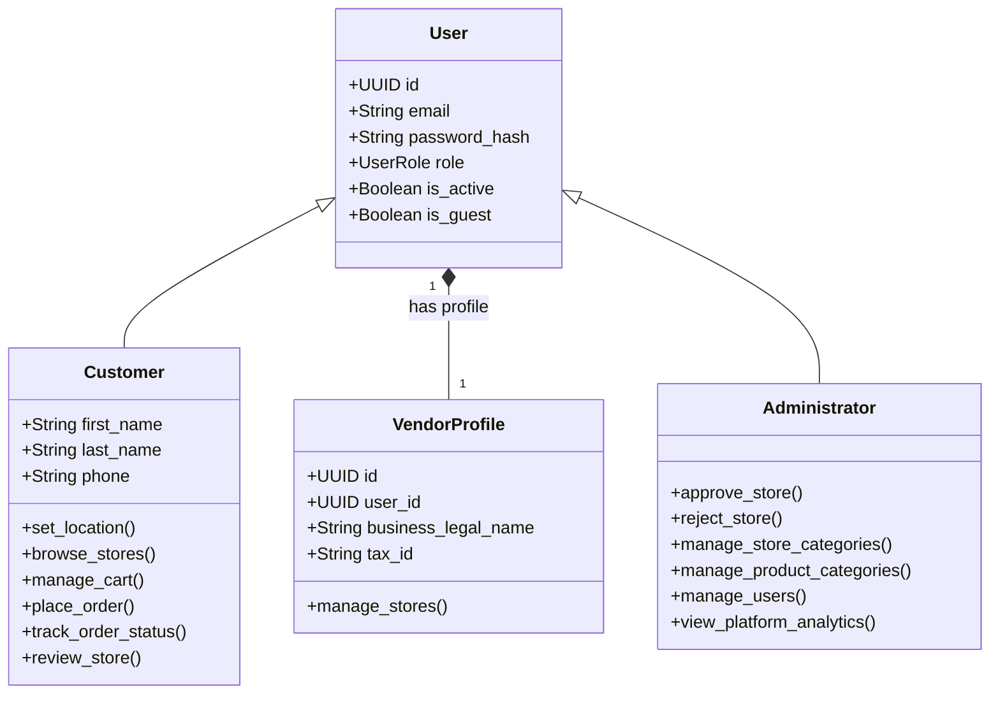

# System Requirements — Overview, Objectives & Scope

> **Module Classification:** System Requirements & Architecture Specification (SRAS)  
> **Document Code:** `REQ-01`  
> **System Version:** 2.1.0  

---

## 1. Project Overview

### 1.1 Project Title
**GeoMarket: A Location-Aware Dynamic Multi-Vendor E-Commerce Platform**

### 1.2 Project Purpose
GeoMarket is an advanced web-based multi-vendor marketplace engineered to bridge the divide between digital e-commerce and local physical retail commerce. Traditional e-commerce platforms operate on a location-agnostic fulfillment model where goods are cataloged nationally and dispatched through multi-day courier networks. GeoMarket establishes a **hyperlocal spatial commerce model**: the system dynamically detects and validates a customer's active location and restricts store discovery to merchants who are physically within reach and capable of fulfilling delivery to that customer's exact coordinates.

### 1.3 Product Concept
The platform operates as a decentralized multi-tenant marketplace where independent physical merchants (groceries, bakeries, pharmacies, electronics, apparel) dynamically register their storefronts, define their exact geographic centroid (latitude and longitude), configure their delivery radius, and manage their product catalogs and inventory. Customers access the marketplace, specify their physical location (via browser geolocation or manual address geocoding), and immediately discover active, approved local stores capable of serving their specific vicinity.

### 1.4 Target Users
1. **Local Consumers & Guests:** Urban and suburban shoppers seeking immediate, local access to retail goods, groceries, and specialty items with transparent local delivery timelines. Can browse and purchase either as registered customers or via seamless guest sessions.
2. **Independent Merchants (Vendors / Store Owners):** Local merchants who lack proprietary digital e-commerce infrastructure but possess local logistics/delivery capability. A registered merchant user owns a `VendorProfile`, which in turn can own and operate multiple distinct `Store` entities.
3. **Platform Administrators:** Institutional or commercial marketplace operators responsible for compliance, vendor verification, store approval, category taxonomy governance, user management, and platform telemetry.

### 1.5 Main Differentiator: Spatial Pre-Filtering vs. Traditional Marketplaces
Unlike conventional multi-vendor platforms (e.g., Daraz, Amazon, AliExpress) where search queries return nationwide product listings, GeoMarket enforces **Spatial Pre-Filtering**:
* Stores are not hardcoded to arbitrary neighborhood names (e.g., "D Ground, Faisalabad").
* Every store defines an exact coordinate centroid and radial coverage boundary ($R_{\text{delivery}}$).
* Discovery is governed by geodesic distance calculations ($d \le R_{\text{delivery}}$), guaranteeing that any store displayed to a customer is physically capable of fulfilling delivery to that customer's coordinates.
* Cart and fulfillment logic are strictly scoped per store for the Minimum Viable Product (MVP), avoiding multi-vendor logistical fragmentation.

### 1.6 High-Level System Architecture Overview

---

## 2. Problem Statement

### 2.1 The Traditional Marketplace Disconnect
Traditional multi-vendor e-commerce architectures assume centralized warehousing or national courier fulfillment. When a customer in an urban center accesses a standard e-commerce platform, they are presented with listings from vendors located hundreds of kilometers away. This architecture fails local commerce in three critical ways:
1. **Logistical Latency:** Deliveries take 2 to 5 days, making daily essentials (groceries, dairy, fresh baked goods, urgent supplies) unviable.
2. **High Shipping Overheads:** National courier rates are disproportionate for low-cost everyday commodities.
3. **Lack of Hyperlocal Trust:** Consumers have existing relationships and familiarity with local physical neighborhood retailers, yet these retailers remain digitally invisible.

### 2.2 The Local Commerce Fragmentation Problem
Local physical merchants face significant barriers in adopting digital commerce:
* Building, hosting, and marketing independent e-commerce applications is cost-prohibitive and technically complex for small-to-medium businesses.
* Existing food-delivery platforms impose high commission structures (25–35%) and are fundamentally optimized for prepared meals rather than diverse retail inventories (hardware, electronics, apparel, stationery).
* Neighborhood businesses lack dynamic tools to define their delivery boundaries, leading to manual order cancellations when customers order from outside their delivery territory.

### 2.3 The Customer Discovery Problem
Customers who wish to support local businesses or receive rapid same-day neighborhood deliveries lack a single discovery engine. They have no centralized platform to query: *"Which bakeries, pharmacies, or electronics shops within 4 kilometers of my current location are open right now and can deliver to my doorstep?"*

### 2.4 Academic Justification
From a software engineering and computer science perspective, solving this requires addressing algorithmic challenges in spatial query optimization, dynamic multi-tenant role-based data isolation, distributed cart consistency, and deterministic state-machine transaction workflows within a relational framework.

---

## 3. Proposed Solution

GeoMarket resolves this market failure through a coordinate-driven, location-aware e-commerce architecture.

### 3.1 Solution Workflow
1. **Dynamic Spatial Onboarding:** Any merchant can register an account, obtain a `VendorProfile`, create a store profile, pin their storefront on an interactive map (capturing latitude and longitude), select a primary store category, and configure a delivery radius ($R$ in kilometers).
2. **Administrative Quality Gate:** The store remains in a `PENDING_APPROVAL` state. Platform administrators inspect merchant credentials and business information before granting `APPROVED` status.
3. **Location Capture & Spatial Filtering:** Upon accessing the customer client, the user's coordinates $(Lat_C, Lon_C)$ are captured via the browser Geolocation API or manual address geocoding. The backend evaluates spatial distances against all approved, active, and order-accepting stores:
   $$\text{Distance}(Store, Customer) \le R_{\text{delivery}}$$
4. **Contextual Shopping Experience:** The customer browses stores categorized by trade (Groceries, Electronics, Apparel, etc.), visits a selected store's digital storefront, and selects items.
5. **Enforced Single-Store Cart Architecture:** To avoid logistics conflicts, the cart enforces single-store integrity. Attempting to add an item from a different store triggers an explicit confirmation modal preventing accidental vendor interleaving.
6. **Controlled Order Lifecycle:** Placed orders follow an explicit, state-transition-enforced lifecycle (`PLACED` to `DELIVERED`) monitored via stepped order status tracking.

---

## 4. Project Objectives

* **OBJ-01 (Dynamic Multi-Tenancy):** Implement an onboarding mechanism where a registered Vendor user possesses a `VendorProfile` capable of creating and managing multiple independent storefronts without developer intervention.
* **OBJ-02 (Coordinate-Driven Discovery):** Formulate and implement an efficient geospatial search algorithm (PostGIS spatial indexing with parameterized raw SQL) to dynamically calculate customer-to-store proximity and filter stores against merchant delivery boundaries.
* **OBJ-03 (Provider Abstraction):** Architect pluggable abstractions for map tiles (`MapTileProvider`) and geocoding (`GeocodingProvider`) to eliminate hard coupling to public, rate-limited third-party infrastructure.
* **OBJ-04 (Single-Vendor Cart Isolation):** Architect a deterministic cart and checkout engine that guarantees transaction atomicity and prevents multi-vendor order collisions during the MVP phase.
* **OBJ-05 (Immutable Order Snapshotting):** Preserve complete audit integrity by snapshotting delivery addresses, geographic coordinates, and product prices at the moment of order placement.
* **OBJ-06 (Finite State Machine Fulfillment):** Design a strictly enforced order state machine validating both transition legitimacy and actor authorization.
* **OBJ-07 (Secure Authentication):** Implement session management exclusively using secure, `HttpOnly`, `SameSite` cookies with BCrypt password hashing.

---

## 5. Project Scope

```mermaid
graph LR
    subgraph IN SCOPE MVP
        A1[VendorProfile Multi-Store Model 1:N]
        A2[Admin Approval & Suspension Workflow]
        A3[4-Tier Coordinate-Based Store Discovery]
        A4[Separate Store & Product Category Taxonomies]
        A5[Product & Inventory Catalog Mgmt]
        A6[Single-Store Cart with Conflict Interception]
        A7[Address Geocoding & Order Location Snapshotting]
        A8[Cash on Delivery COD Payment Model]
        A9[Order Status Tracking PLACED to DELIVERED]
        A10[Verified Customer Store Reviews]
        A11[Pluggable Map & Geocoding Abstractions]
        A12[HttpOnly Cookie JWT Authentication]
        A13[BCrypt Password Hashing]
        A14[Guest Checkout & Guest Order Lookup]
        A15[Cross-Store Products Catalog & Single Product Page]
        A16[Platform Admin Analytics & User Governance]
    end

    subgraph OUT OF SCOPE Post-MVP / Future Work
        B1[Third-Party Automated Rider Fleet Dispatch]
        B2[Real-Time Continuous Rider GPS Telemetry]
        B3[Multi-Vendor Split-Cart Unified Checkout]
        B4[Online Payment Gateway Integration Stripe / JazzCash]
        B5[AI/ML Personalized Recommendation Engines]
        B6[Dynamic Surge Pricing Algorithms]
        B7[Customer-to-Merchant In-App Voice/Chat]
    end
```

---

## 6. Actors and Roles

### 6.1 Customer & Guest
* **Description:** An authenticated end-user or guest visitor who accesses the application to discover local stores and products, configure quantities, place orders, and track fulfillment status.
* **Responsibilities:** Maintain accurate profile information, provide precise delivery coordinates, review order contents prior to submission, and accept delivery via Cash on Delivery.
* **Permissions:** Read approved stores and active products; manage own cart; create and read own orders; track order status; create reviews for fulfilled orders (authenticated); manage personal delivery addresses.

### 6.2 Vendor / Store Owner
* **Description:** A registered merchant entity represented by a `VendorProfile` that owns and operates one or more physical retail outlets (`Stores`).
* **Responsibilities:** Maintain accurate store operational data (coordinates, operating hours, delivery radius, order acceptance toggle), maintain real-time inventory counts, update order statuses truthfully, and execute fulfillment.
* **Permissions:** Create store entities under owned `VendorProfile` (initially pending approval); manage owned store profiles and delivery settings; CRUD operations on products and inventory within owned stores; view and update statuses of orders placed with owned stores.
* **Authorization Rule:** A vendor is authorized to manage a store if and only if:
  $$\text{store}.\text{vendor\_profile\_id} == \text{authenticated\_user}.\text{vendor\_profile}.\text{id}$$

### 6.3 Platform Administrator
* **Description:** A privileged user responsible for platform integrity, security, category taxonomies, merchant onboarding compliance, user governance, and operational dispute management.
* **Responsibilities:** Verify legitimacy of registered vendor stores, enforce platform standards, oversee user accounts, inspect platform financial telemetry, and manage platform-wide classification categories.
* **Permissions:** Read all platform entities; approve/reject/suspend stores; activate/deactivate users; promote/demote roles; manage store and product categories; override order statuses in dispute; view aggregate business intelligence analytics.
