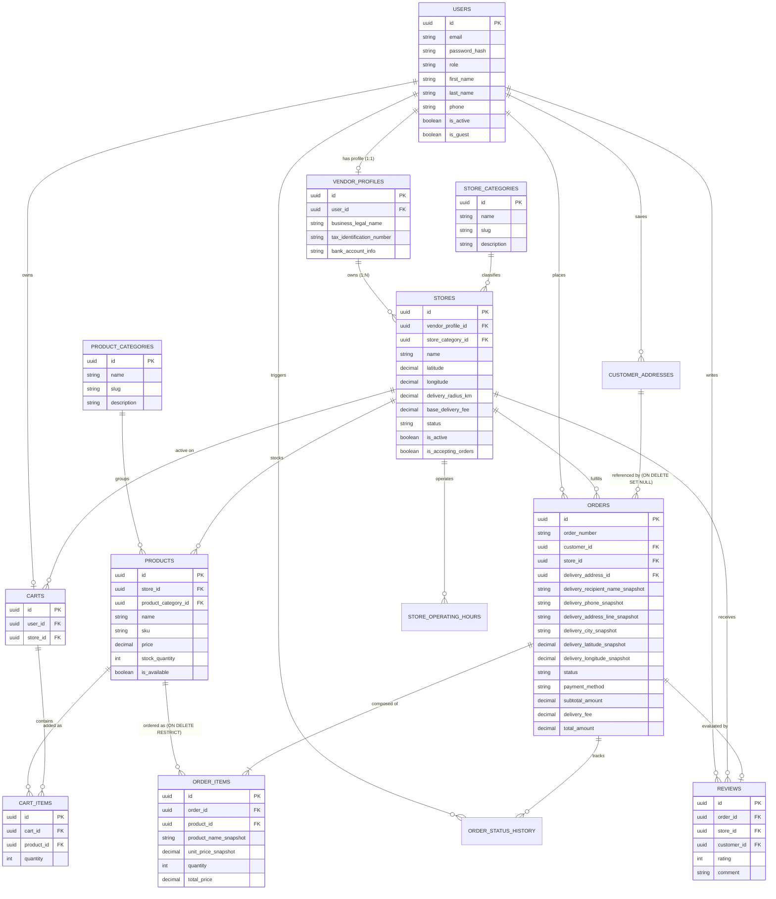

# System Requirements — Database Architecture & ERD Specification

> **Module Classification:** System Requirements & Architecture Specification (SRAS)  
> **Document Code:** `REQ-03`  
> **System Version:** 2.1.0  

---

## 1. Data Access Strategy: Prisma ORM + PostGIS Parameterized SQL

1. **Standard Relational Access:** Prisma ORM is utilized for standard relational CRUD operations, schema migrations, typed models, foreign key enforcement, and relational loading (`include`, `select`).
2. **PostGIS Geospatial Operations:** Because Prisma does not natively abstract spatial functions, PostGIS spatial queries are executed via **parameterized raw SQL** (`prisma.$queryRaw`) encapsulated strictly within the `StoreRepository` / `LocationService`.
3. **Security:** All spatial queries must remain strictly parameterized using template literals or parameter binding to prevent SQL injection vulnerabilities.

---

## 2. Entity Specifications

### 1. `users`
* **Purpose:** Identity credentials for all actors.
* **Attributes:** `id` (UUID, PK), `email` (VARCHAR 255, Unique), `password_hash` (VARCHAR 255), `role` (ENUM: 'CUSTOMER', 'VENDOR', 'ADMIN'), `first_name` (VARCHAR 100), `last_name` (VARCHAR 100), `phone` (VARCHAR 20), `is_active` (BOOLEAN, Default: TRUE), `is_guest` (BOOLEAN, Default: FALSE), `created_at`, `updated_at`.

### 2. `vendor_profiles`
* **Purpose:** Merchant profile linking a Vendor User to multiple Stores ($1:1$ with User, $1:N$ with Stores).
* **Attributes:** `id` (UUID, PK), `user_id` (UUID, FK $\rightarrow$ `users.id`, Unique), `business_legal_name` (VARCHAR 255), `tax_identification_number` (VARCHAR 100, Nullable), `bank_account_info` (TEXT, Nullable), `created_at`.

### 3. `store_categories`
* **Purpose:** Classifies physical store trades (Groceries, Bakeries, etc.).
* **Attributes:** `id` (UUID, PK), `name` (VARCHAR 100, Unique), `slug` (VARCHAR 100, Unique), `description` (TEXT), `icon_url` (VARCHAR 500), `is_active` (BOOLEAN, Default: TRUE), `created_at`.

### 4. `stores`
* **Purpose:** Physical retail outlets owned by a VendorProfile.
* **Attributes:** `id` (UUID, PK), `vendor_profile_id` (UUID, FK $\rightarrow$ `vendor_profiles.id`), `store_category_id` (UUID, FK $\rightarrow$ `store_categories.id`), `name` (VARCHAR 255), `slug` (VARCHAR 255, Unique), `description` (TEXT), `address_line` (VARCHAR 500), `city` (VARCHAR 100), `latitude` (DECIMAL 10,8), `longitude` (DECIMAL 11,8), `delivery_radius_km` (DECIMAL 5,2, Check $> 0$), `base_delivery_fee` (DECIMAL 10,2), `min_order_amount` (DECIMAL 10,2), `status` (ENUM: 'PENDING_APPROVAL', 'APPROVED', 'REJECTED', 'SUSPENDED'), `is_active` (BOOLEAN, Default: FALSE), `is_accepting_orders` (BOOLEAN, Default: TRUE), `average_rating` (DECIMAL 3,2, Default: 0.00), `total_reviews` (INTEGER, Default: 0), `created_at`, `updated_at`.
* **Spatial Column:** `location` (`geography(Point, 4326)` GENERATED ALWAYS AS Point from coordinates STORED, indexed via GiST).

### 5. `store_operating_hours`
* **Purpose:** Weekly schedules per store (7 records per store, days 0–6).
* **Attributes:** `id` (UUID, PK), `store_id` (UUID, FK $\rightarrow$ `stores.id`), `day_of_week` (SMALLINT, 0 = Sunday, 6 = Saturday), `opening_time` (TIME), `closing_time` (TIME), `is_closed` (BOOLEAN, Default: FALSE).

### 6. `product_categories`
* **Purpose:** Classifies merchandise items (Dairy, Cables, etc.).
* **Attributes:** `id` (UUID, PK), `name` (VARCHAR 100, NOT NULL), `slug` (VARCHAR 100, NOT NULL), `description` (TEXT), `created_at`.

### 7. `products`
* **Purpose:** Merchandise cataloged under a specific store.
* **Attributes:** `id` (UUID, PK), `store_id` (UUID, FK $\rightarrow$ `stores.id`), `product_category_id` (UUID, FK $\rightarrow$ `product_categories.id`), `name` (VARCHAR 255), `description` (TEXT), `sku` (VARCHAR 100), `price` (DECIMAL 10,2, Check $> 0$), `stock_quantity` (INTEGER, Check $\ge 0$), `is_available` (BOOLEAN, Default: TRUE), `image_url` (VARCHAR 500), `created_at`, `updated_at`. *Constraint:* UNIQUE(`store_id`, `sku`).

### 8. `customer_addresses`
* **Purpose:** Saved delivery endpoints for customers.
* **Attributes:** `id` (UUID, PK), `user_id` (UUID, FK $\rightarrow$ `users.id`), `address_label` (VARCHAR 50), `address_line` (VARCHAR 500), `city` (VARCHAR 100), `latitude` (DECIMAL 10,8), `longitude` (DECIMAL 11,8), `is_default` (BOOLEAN, Default: FALSE).
* **Constraint:** Partial unique index `UNIQUE(user_id) WHERE is_default = true`.

### 9. `carts`
* **Purpose:** Active shopping basket header for a customer or guest.
* **Attributes:** `id` (UUID, PK), `user_id` (UUID, FK $\rightarrow$ `users.id`, Unique), `store_id` (UUID, FK $\rightarrow$ `stores.id`, Nullable), `created_at`, `updated_at`.

### 10. `cart_items`
* **Purpose:** Line items within a customer's active cart.
* **Attributes:** `id` (UUID, PK), `cart_id` (UUID, FK $\rightarrow$ `carts.id` ON DELETE CASCADE), `product_id` (UUID, FK $\rightarrow$ `products.id`), `quantity` (INTEGER, Check $> 0$). *Constraint:* UNIQUE(`cart_id`, `product_id`).

### 11. `orders`
* **Purpose:** Fulfilled purchase transactions bound to a single store with snapshot integrity.
* **Attributes:** `id` (UUID, PK), `order_number` (VARCHAR 50, Unique), `customer_id` (UUID, FK $\rightarrow$ `users.id`), `store_id` (UUID, FK $\rightarrow$ `stores.id`), `delivery_address_id` (UUID, FK $\rightarrow$ `customer_addresses.id`, ON DELETE SET NULL, Nullable), `delivery_recipient_name_snapshot` (VARCHAR 200), `delivery_phone_snapshot` (VARCHAR 20), `delivery_address_line_snapshot` (VARCHAR 500), `delivery_city_snapshot` (VARCHAR 100), `delivery_latitude_snapshot` (DECIMAL 10,8), `delivery_longitude_snapshot` (DECIMAL 11,8), `status` (ENUM: 'PLACED', 'CONFIRMED', 'PREPARING', 'READY', 'OUT_FOR_DELIVERY', 'DELIVERED', 'CANCELLED'), `payment_method` (ENUM: 'CASH_ON_DELIVERY'), `subtotal_amount` (DECIMAL 10,2), `delivery_fee` (DECIMAL 10,2), `total_amount` (DECIMAL 10,2), `cancellation_reason` (TEXT, Nullable), `cancelled_by` (UUID, FK $\rightarrow$ `users.id`, Nullable), `created_at`, `updated_at`.

### 12. `order_items`
* **Purpose:** Immutable line items for placed orders.
* **Attributes:** `id` (UUID, PK), `order_id` (UUID, FK $\rightarrow$ `orders.id` ON DELETE RESTRICT), `product_id` (UUID, FK $\rightarrow$ `products.id` ON DELETE RESTRICT), `product_name_snapshot` (VARCHAR 255), `unit_price_snapshot` (DECIMAL 10,2), `quantity` (INTEGER), `total_price` (DECIMAL 10,2).

### 13. `order_status_history`
* **Purpose:** Audit trail of order lifecycle state changes.
* **Attributes:** `id` (UUID, PK), `order_id` (UUID, FK $\rightarrow$ `orders.id` ON DELETE CASCADE), `previous_status` (VARCHAR 50), `new_status` (VARCHAR 50), `changed_by_user_id` (UUID, FK $\rightarrow$ `users.id`), `notes` (TEXT), `created_at`.

### 14. `reviews`
* **Purpose:** Verified customer ratings and commentary for fulfilled orders.
* **Attributes:** `id` (UUID, PK), `order_id` (UUID, FK $\rightarrow$ `orders.id`, Unique), `customer_id` (UUID, FK $\rightarrow$ `users.id`), `store_id` (UUID, FK $\rightarrow$ `stores.id`), `rating` (SMALLINT, Check 1–5), `comment` (TEXT), `created_at`.

---

## 3. Database Relationships / Final ERD

