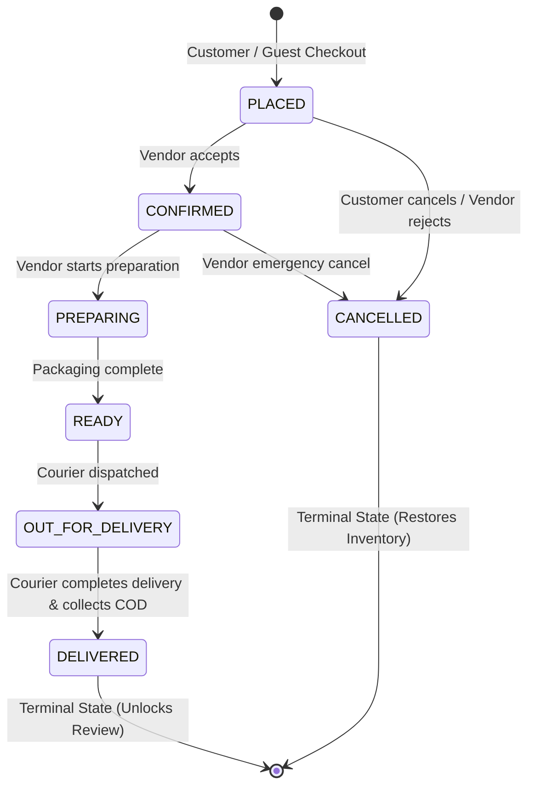
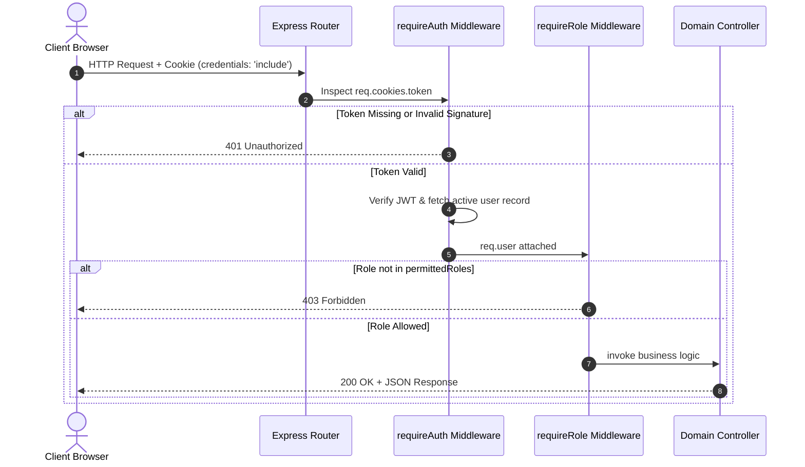

# System Requirements — Order FSM & Security Architecture

> **Module Classification:** System Requirements & Architecture Specification (SRAS)  
> **Document Code:** `REQ-04`  
> **System Version:** 2.1.0  

---

## 1. Order Transition Authorization Matrix

Every order state transition must satisfy dual validation at the backend layer:
1. **Transition Validity:** The target state is an allowed forward path in the Finite State Machine (FSM).
2. **Actor Authorization:** The requesting actor has explicit permission to execute the transition.

### Detailed Transition Authorization Table

| From State | To State | Permitted Actor | Authorization & Business Rule Validation | Side Effects |
| :--- | :--- | :--- | :--- | :--- |
| `[NULL]` | `PLACED` | **Customer / Guest** | Cart is non-empty; address within delivery radius; store open & active. | Deduct inventory stock atomically; record address & price snapshots; clear cart. |
| `PLACED` | `CANCELLED` | **Customer** | `order.customer_id == authenticated_user.id`. Customer can cancel only while status is `PLACED`. | Atomically restore inventory stock; write audit log. |
| `PLACED` | `CONFIRMED` | **Vendor** | `order.store.vendor_profile.user_id == authenticated_user.id`. Vendor accepts order. | Transition state; write audit log; alert customer. |
| `PLACED` | `CANCELLED` | **Vendor** | `order.store.vendor_profile.user_id == authenticated_user.id`. Mandatory cancellation reason string required. | Atomically restore inventory stock; write cancellation reason & audit log. |
| `CONFIRMED` | `PREPARING` | **Vendor** | `order.store.vendor_profile.user_id == authenticated_user.id`. Order enters preparation/packaging. | Transition state; write audit log. |
| `CONFIRMED` | `CANCELLED` | **Vendor** | `order.store.vendor_profile.user_id == authenticated_user.id`. Emergency rejection with mandatory reason. | Atomically restore inventory stock; write audit log. |
| `PREPARING` | `READY` | **Vendor** | `order.store.vendor_profile.user_id == authenticated_user.id`. Packaging complete; awaiting dispatch. | Transition state; write audit log. |
| `READY` | `OUT_FOR_DELIVERY` | **Vendor** | `order.store.vendor_profile.user_id == authenticated_user.id`. Store courier departs for destination. | Record dispatch timestamp; write audit log. |
| `OUT_FOR_DELIVERY` | `DELIVERED` | **Vendor** | `order.store.vendor_profile.user_id == authenticated_user.id`. Courier hands over goods and collects COD payment. | Automatically transition `paymentStatus = PAID`; unlock verified review creation for customer; mark terminal state. |
| *Any Active State* | `CANCELLED` | **Admin** | `authenticated_user.role == 'ADMIN'`. Administrative intervention (dispute resolution / fraud). | Restore stock; record administrative note. |

---

## 2. Authentication & Security Architecture

### 2.1 Password Hashing Specification
* **Algorithm:** **BCrypt**
* **Work Factor:** Cost factor 12 ($2^{12}$ rounds).
* **Policy:** Raw passwords are never persisted, cached, or logged. BCrypt salting is generated uniquely per password hash. Timing-safe comparison defends against timing attacks on failed authentications.

### 2.2 Session & Token Credential Storage
* **Mechanism:** Signed JSON Web Tokens (JWT) using HMAC-SHA256 with 256-bit secret.
* **Storage Location:** Strictly transmitted via **Secure, HttpOnly, SameSite cookies**.
* **Prohibition:** Storage of JWTs in browser `localStorage` or `sessionStorage` is strictly forbidden.
* **Cookie Configuration Attributes:**
  * `HttpOnly: true` — Inaccessible to JavaScript `document.cookie`, providing complete immunity against token exfiltration via Cross-Site Scripting (XSS).
  * `Secure: true` — Transmitted only over encrypted TLS/HTTPS connections (set to `false` only in non-HTTPS local dev environments via environment variables).
  * `SameSite: 'Lax'` — Defends against Cross-Site Request Forgery (CSRF) while permitting top-level navigation.
  * `Path: '/'` — Scoped to the entire API origin.
  * `Max-Age / Expires:` Configured to 604,800 seconds (7 days).
* **Client Integration:** The frontend (React / Axios / Fetch) configures `credentials: 'include'` on all API requests.

### 2.3 Role-Based Access Control (RBAC) & Middleware Pipeline

---

## 3. Multi-Tenant Isolation & Anti-Enumeration Protections

1. **No Direct Request Parameter Trust:** The backend never trusts a client-supplied `vendorProfileId` or `userId` in request bodies. The identity is derived strictly from the verified JWT payload (`req.user.vendorProfileId`).
2. **Server-Side Store Ownership Verification:** Every operation targeting a store validates ownership against the requesting actor.
3. **Anti-Enumeration 404 Protection:** If Vendor A attempts to inspect or mutate an entity belonging to Vendor B, the server responds with a generic `404 Not Found` rather than `403 Forbidden`. This prevents malicious actors from mapping out other merchants' entities.
