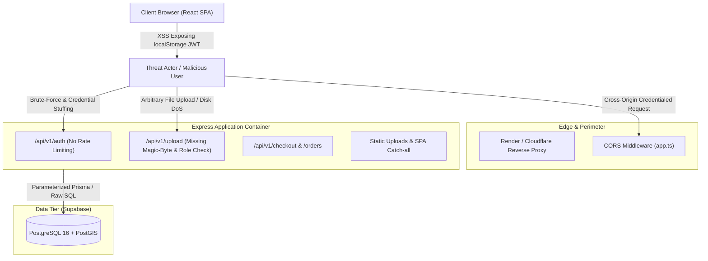

# Comprehensive Full-Stack Security & Vulnerability Audit
**Project:** GeoMarket (Location-Aware Dynamic Multi-Vendor Marketplace)  
**Target Environment:** Node.js 22, Express 4, TypeScript, Prisma ORM, PostgreSQL + PostGIS, React 18 + Vite, Render (Docker Runtime)  
**Assessment Date:** September 2026  
**Auditor:** Senior Security Architect & Full-Stack Engineer  
**Methodology:** OWASP Top 10 (2021), ASVS Level 2, Source Code Static Analysis (SAST), Dependency Composition Analysis (SCA), Infrastructure & Configuration Review.

---

## 1. Executive Summary

A comprehensive full-stack security and vulnerability audit was conducted on the **GeoMarket** application. The codebase comprises a modular monorepo spanning backend API services, client Single-Page Application (SPA), shared contract types, database migrations (Prisma/PostGIS), and containerized deployment infrastructure (Render/Docker).

The overall security posture is **Moderate-High**: the engineering team demonstrated commendable defensive design in core transactional logic (PostgreSQL row-level locking, strict parameterization of raw SQL, and timing-safe authentication comparisons). However, critical vulnerabilities and misconfigurations were identified in **client-side token storage, cross-origin resource sharing (CORS), missing rate limiting, unrestricted file uploads, and outdated third-party dependencies**.

### Vulnerability Severity Distribution
| Critical | High | Medium | Low / Informational | Total Findings |
| :---: | :---: | :---: | :---: | :---: |
| **2** | **4** | **5** | **4** | **15** |

---

## 2. Threat Landscape & Attack Surface Map



---

## 3. Comprehensive Vulnerability Matrix

| ID | Vulnerability Title | OWASP Category | Severity | CVSS v3.1 | Status |
| :--- | :--- | :--- | :---: | :---: | :---: |
| **SEC-01** | JWT Duplicated in LocalStorage Bypassing HttpOnly Protection | A03: Injection / Data Exposure | **High** | 7.5 | Action Required |
| **SEC-02** | Wildcard Origin Reflection with Credentials Enabled (CORS) | A05: Security Misconfiguration | **High** | 7.4 | Action Required |
| **SEC-03** | Lack of Rate Limiting on Authentication & Order Tracking | A07: Identification Failures | **High** | 7.3 | Action Required |
| **SEC-04** | Unrestricted MIME Spoofing & Missing Magic Byte Check in Uploads | A04: Insecure Design | **High** | 7.1 | Action Required |
| **SEC-05** | Missing Role-Based Access Control on Upload Endpoint | A01: Broken Access Control | **Medium** | 6.5 | Action Required |
| **SEC-06** | Known Critical Vulnerabilities in Third-Party Dependencies | A06: Vulnerable Components | **Critical** | 9.8 | Action Required |
| **SEC-07** | Absence of HTTP Security Headers (No Helmet / Technology Leak) | A05: Security Misconfiguration | **Medium** | 5.3 | Action Required |
| **SEC-08** | Legacy `SameSite=None` Cookie in Single-Origin Topology | A01: Broken Access Control | **Medium** | 4.8 | Action Required |
| **SEC-09** | Ephemeral Local File Storage Vulnerable to Data Loss & DoS | A04: Insecure Design | **Medium** | 5.0 | Action Required |
| **SEC-10** | Unrestricted Guest Account Generation | A07: Identification Failures | **Low** | 3.8 | Action Required |
| **SEC-11** | Missing Audit Trail Logging for Administrative Actions | A09: Logging Failures | **Low** | 3.1 | Action Required |

---

## 4. Deep-Dive Vulnerability Analysis (A to Z)

### SEC-01: JWT Duplicated in `localStorage` Bypassing `HttpOnly` Cookie
* **Location:** `server/src/modules/auth/auth.controller.ts:28,48` & `client/src/lib/api.ts:60-70`
* **OWASP Category:** A03:2021 – Injection / Sensitive Data Exposure
* **Severity:** **HIGH (CVSS: 7.5)**
* **Mechanism:**
  While the backend sets an `HttpOnly` cookie (`res.cookie('token', token)`), it simultaneously returns `{ user, token }` in the JSON response body. The frontend client then invokes:
  ```typescript
  localStorage.setItem('geomarket_auth_token', token);
  ```
  `HttpOnly` cookies are designed to be completely inaccessible to JavaScript, mitigating the risk of credential theft via Cross-Site Scripting (XSS). Storing the bearer token in `localStorage` completely nullifies this defense. Any third-party npm package, CDN script, or injection flaw allows immediate exfiltration of user tokens via `localStorage.getItem()`.
* **Remediation:**
  Rely exclusively on `HttpOnly` cookies for browser session persistence. Remove token persistence from `localStorage`.

---

### SEC-02: Overly Permissive CORS with Credential Reflection
* **Location:** `server/src/app.ts:18-28`
* **OWASP Category:** A05:2021 – Security Misconfiguration
* **Severity:** **HIGH (CVSS: 7.4)**
* **Mechanism:**
  The CORS middleware allows wildcard origin handling combined with credentials:
  ```typescript
  const allowedOrigins = env.CLIENT_ORIGIN.split(',').map((o) => o.trim());
  const allowAllOrigins = allowedOrigins.includes('*');

  app.use(cors({
    origin: (origin, callback) => {
      if (!origin || env.NODE_ENV !== 'production' || allowAllOrigins || allowedOrigins.includes(origin)) {
        return callback(null, true);
      }
      return callback(new Error('Not allowed by CORS'));
    },
    credentials: true,
  }));
  ```
  When `CLIENT_ORIGIN` contains `*`, Express dynamically reflects the incoming `Origin` header (e.g., `https://malicious-site.com`) as `Access-Control-Allow-Origin: https://malicious-site.com` while maintaining `Access-Control-Allow-Credentials: true`. This allows malicious third-party origins to perform authenticated credentialed requests against the backend.
* **Remediation:**
  In production, strictly disallow wildcard origins when `credentials: true` is enabled. Since the Docker container serves both frontend and API from the same origin, restrict CORS to verified domains or disable cross-origin requests entirely.

---

### SEC-03: Lack of Rate Limiting on Authentication & Tracking Endpoints
* **Location:** `server/src/modules/auth/auth.router.ts` & `server/src/modules/order/order.controller.ts:38`
* **OWASP Category:** A07:2021 – Identification and Authentication Failures
* **Severity:** **HIGH (CVSS: 7.3)**
* **Mechanism:**
  The server does not employ IP-based or account-based rate limiting (such as `express-rate-limit`). 
  1. Attackers can execute automated password dictionary attacks against `/api/v1/auth/login`.
  2. Attackers can automate phone number enumeration against `/api/v1/orders/track` by brute-forcing contact numbers against known Order UUIDs.
* **Remediation:**
  Implement `express-rate-limit` with an in-memory or Redis-backed window:
  - 5 requests per 15 minutes for `/api/v1/auth/login`
  - 10 requests per 10 minutes for `/api/v1/orders/track`

---

### SEC-04: Unrestricted MIME Spoofing & Missing Magic Byte Check in Uploads
* **Location:** `server/src/modules/upload/upload.router.ts:16-35`
* **OWASP Category:** A04:2021 – Insecure Design / File Upload Vulnerabilities
* **Severity:** **HIGH (CVSS: 7.1)**
* **Mechanism:**
  The file upload route extracts the MIME type directly from the client-controlled data URI:
  ```typescript
  const matches = image.match(/^data:([A-Za-z-+/]+);base64,(.+)$/);
  ```
  It validates against `allowedMimeTypes = ['image/jpeg', 'image/png', ...]` based solely on the client's declared string. An attacker can craft a payload starting with `data:image/png;base64,...` containing arbitrary binary or HTML payloads. The server does not inspect image file headers (magic bytes) using packages like `file-type` or `sharp`.
* **Remediation:**
  Inspect the raw buffer's magic bytes (first 4–12 bytes) using `file-type` to detect the true format before saving to disk.

---

### SEC-05: Missing Role-Based Authorization on Upload Route
* **Location:** `server/src/modules/upload/upload.router.ts:9`
* **OWASP Category:** A01:2021 – Broken Access Control
* **Severity:** **MEDIUM (CVSS: 6.5)**
* **Mechanism:**
  The upload endpoint specifies `router.post('/', requireAuth, ...)` without role checks. Consequently, regular `CUSTOMER` accounts and temporary `GUEST` sessions can upload files up to 5MB, despite product images and store logos being exclusive to `VENDOR` and `ADMIN` workflows.
* **Remediation:**
  Apply `requireRole(UserRole.VENDOR, UserRole.ADMIN)` to restrict file uploads strictly to authorized actors.

---

### SEC-06: Known Critical Vulnerabilities in Third-Party Dependencies
* **Location:** `package.json` / `pnpm-lock.yaml`
* **OWASP Category:** A06:2021 – Vulnerable and Outdated Components
* **Severity:** **CRITICAL (CVSS: 9.8)**
* **Findings from `pnpm audit`:**
  - **GHSA-5xrq-8626-4rwp (Critical):** `vitest@1.6.1` contains an arbitrary file read and execution vulnerability when the test UI server is running.
  - **GHSA-23hp-3jrh-7fpw (Critical):** `tar <=7.5.18` (nested dependency under `bcrypt > @mapbox/node-pre-gyp`) is vulnerable to unbounded CPU DoS during archive decompression.
  - **GHSA-fx2h-pf6j-xcff (High):** `vite@5.4.21` contains a `server.fs.deny` bypass on Windows operating systems.
* **Remediation:**
  Update dependencies using `pnpm update vitest@latest vite@latest` and utilize `pnpm.overrides` in `package.json` to force patched versions of transitive dependencies (`tar >= 7.5.19`).

---

### SEC-07: Missing Security Headers & Information Disclosure
* **Location:** `server/src/app.ts`
* **OWASP Category:** A05:2021 – Security Misconfiguration
* **Severity:** **MEDIUM (CVSS: 5.3)**
* **Mechanism:**
  Inspection of live HTTP response headers reveals:
  - `x-powered-by: Express` is broadcasted on every response, advertising server framework details to reconnaissance scanners.
  - Missing `X-Content-Type-Options: nosniff` (enables MIME-sniffing attacks on uploaded static files).
  - Missing `X-Frame-Options: DENY` or `Content-Security-Policy: frame-ancestors 'none'` (permits Clickjacking).
  - Missing `Strict-Transport-Security` (HSTS).
* **Remediation:**
  Install and mount `helmet`:
  ```typescript
  import helmet from 'helmet';
  app.use(helmet({ contentSecurityPolicy: false })); // Configure CSP according to assets
  app.disable('x-powered-by');
  ```

---

### SEC-08: Legacy `SameSite=None` in Unified Same-Origin Deployment
* **Location:** `server/src/modules/auth/auth.controller.ts:11`
* **OWASP Category:** A01:2021 – Broken Access Control / CSRF
* **Severity:** **MEDIUM (CVSS: 4.8)**
* **Mechanism:**
  When the application previously operated across two separate domains (`geomarket-1.onrender.com` frontend and `geomarket.onrender.com` backend), `sameSite: 'none'` was required. Now that both are unified in Docker under `geomarket-docker.onrender.com`, `sameSite: 'none'` needlessly weakens CSRF protection.
* **Remediation:**
  Change cookie policy to `sameSite: 'lax'` in production.

---

### SEC-09: Ephemeral File Storage & Denial of Service Vulnerability
* **Location:** `Dockerfile` & `server/src/modules/upload/upload.router.ts:40-52`
* **OWASP Category:** A04:2021 – Insecure Design
* **Severity:** **MEDIUM (CVSS: 5.0)**
* **Mechanism:**
  Uploaded images are written to the container's local `/app/server/public/uploads` directory. On Render's ephemeral container filesystem, all uploaded files are permanently deleted whenever the service restarts or redeploys. Furthermore, an attacker can flood the server with 5MB uploads until container memory or disk limits crash the node instance.
* **Remediation:**
  Migrate media storage to Supabase Storage or AWS S3 via presigned URLs, decoupling file storage from the application server.

---

## 5. Architectural Strengths & Existing Defenses

The audit revealed multiple positive security practices already engineered into GeoMarket:

1. **SQL Injection Immunity:**
   - No dynamic string concatenation in database operations.
   - Spatial queries in `discovery.repository.ts` properly utilize `Prisma.sql` and `Prisma.join` tagged templates, enforcing parameter binding at the driver level.
   - Zero usage of `$queryRawUnsafe` or `$executeRawUnsafe`.

2. **Timing-Attack Immune Authentication:**
   - `auth.service.ts:98-105` defends against user enumeration timing attacks: when an unknown email is supplied, the server computes a dummy BCrypt hash (`cost factor 12`) to normalize response times before throwing a generic `INVALID_CREDENTIALS` error.

3. **Concurrency & Race Condition Defenses:**
   - Atomic inventory adjustments and checkout processing employ PostgreSQL row-level locks (`SELECT ... FOR UPDATE ORDER BY id`), guaranteeing deterministic lock ordering and preventing lost updates or negative inventory during flash sales.

4. **Multi-Tenant Ownership Verification & Anti-Enumeration:**
   - Vendor store and product controllers derive `vendorProfileId` directly from the validated JWT token rather than trusting user-submitted route bodies.
   - Unauthorized object accesses return `404 Not Found` rather than `403 Forbidden`, preventing resource enumeration.

5. **Input Validation Rigor:**
   - Comprehensive Zod validation on incoming request bodies across all controllers prevents type confusion and schema pollution.

---

## 6. Prioritized Remediation Roadmap

```
[Phase 1: Immediate Critical Hardening (0-24 Hours)]
├── Fix SEC-01: Remove localStorage token storage in client
├── Fix SEC-02: Eliminate wildcard CORS reflection in server/src/app.ts
├── Fix SEC-05: Enforce requireRole(VENDOR, ADMIN) on /api/v1/upload
└── Fix SEC-07: Install and mount 'helmet' middleware & disable x-powered-by

[Phase 2: High Priority Mitigations (1-3 Days)]
├── Fix SEC-03: Add 'express-rate-limit' to auth and lookup routes
├── Fix SEC-04: Implement magic-byte verification on uploaded images
├── Fix SEC-08: Switch cookie SameSite attribute from 'none' to 'lax'
└── Fix SEC-06: Upgrade vulnerable npm dependencies (vite, vitest, tar)

[Phase 3: Architecture Modernization (1-2 Weeks)]
├── Fix SEC-09: Migrate local image uploads to Supabase Object Storage
├── Fix SEC-10: Add IP rate limits and TTL cleanup for guest sessions
└── Fix SEC-11: Implement structured audit logging for administrative mutations
```
